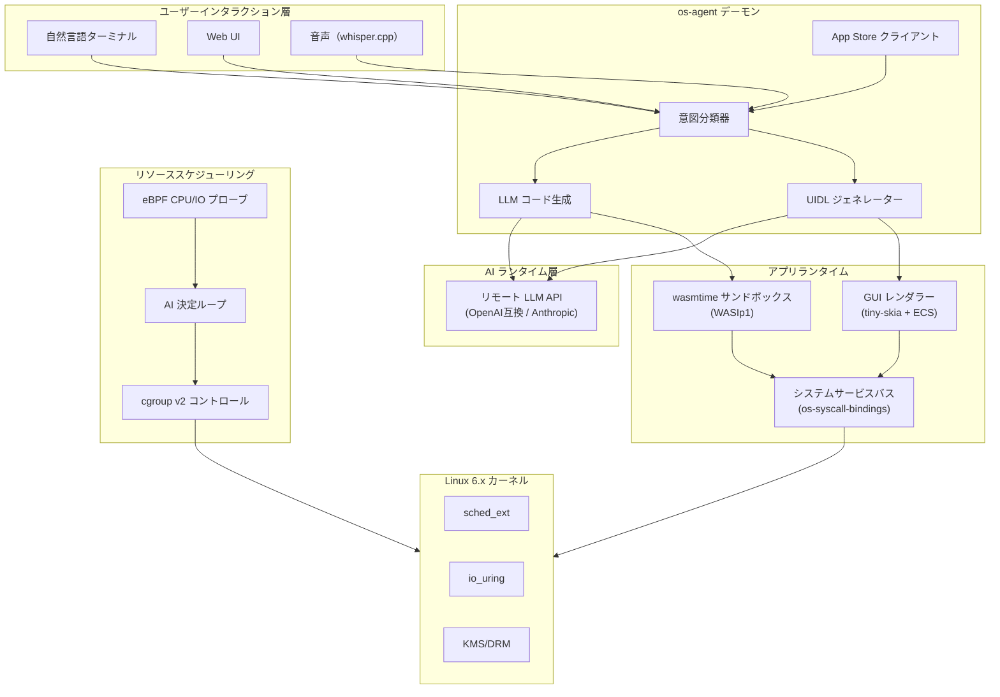
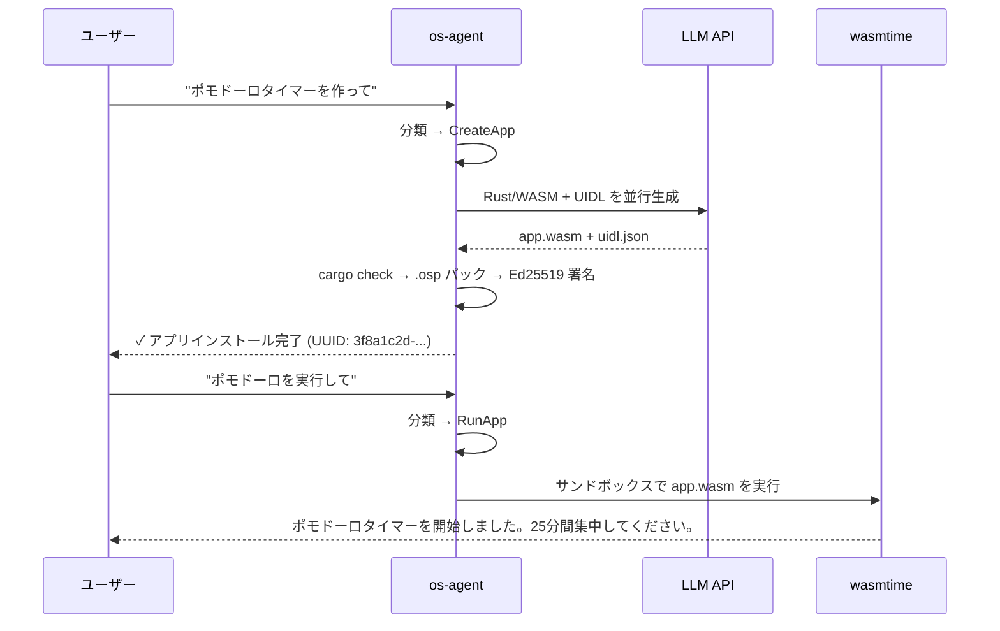

# openSystem

**AIを前提とするOS。**

[](https://github.com/soolaugust/openSystem/actions)
[](https://github.com/soolaugust/openSystem/releases)
[](https://github.com/soolaugust/openSystem/actions)
[](https://github.com/soolaugust/openSystem/actions)
[](LICENSE)

> ⚠️ **実験的プロジェクト。** 本プロジェクトは初期研究段階にあり、本番環境での使用は推奨されません。
> API、設定形式、アーキテクチャは予告なく変更される場合があります。コントリビューションや大胆なアイデアを歓迎します。

[English](README.md) | [简体中文](README.zh-CN.md) | 日本語 | [한국어](README.ko.md)

---

今日存在するすべてのオペレーティングシステムは、大規模言語モデルが登場する前に設計されました。
Linuxは人間が操作するために設計されました。openSystemはAIが操作するために設計されています——
そして人間が*指示*する。

openSystemはLinuxディストリビューションではありません。研究プロトタイプでもありません。
これは明確な賭けです：5年以内に、あらゆる意味のあるOS操作がAIによって仲介されるでしょう。
私たちはその前提から出発したOSを構築しています。50年のPOSIXレガシーの上にAIを乗せるのではなく。

**あなたが以下を信じるなら、このプロジェクトはあなたを怒らせるでしょう：**
- 決定論的システムは常に確率的システムより安全だ
- ユーザーはOSが何をしているか理解すべきだ
- POSIX互換性は制約ではなく機能だ

**あなたが以下を信じるなら、このプロジェクトはあなたのためにあります：**
- 1970年代のシェルの比喩はとっくに役目を終えている
- AI推論はシステムコールパスに組み込むほど安価になっている
- あなたがこれまで使った中で最高のOSはまだ構築されていない

---

## デモ

> 一言話しかけるだけで、30秒以内に動くアプリが手に入ります。

<p align="center">
  
</p>

**何が起きたか：** 自然言語 → LLMがRust/WASMコードを生成 → コンパイル → Ed25519署名済み`.osp`パッケージ → インストール → wasmtimeサンドボックスで実行。パッケージマネージャー不要。アプリストアの審査不要。既存のバイナリ不要。

---

## 現在の機能（v0.5.0）

| 機能 | 状態 | 実装 |
|------|------|------|
| 自然言語 → アプリ作成 | ✅ 動作中 | `os-agent` 意図パイプライン + LLM コード生成 |
| WASM サンドボックス実行 | ✅ 動作中 | wasmtime / WASIp1、`MemoryOutputPipe` 出力キャプチャ |
| App Store インストール/検索 | ✅ 動作中 | SQLite レジストリ + Ed25519署名 `.osp` パッケージ |
| パッケージ署名検証 | ✅ 動作中 | `OspPackage::verify_signature` + E2Eテスト |
| ソフトウェア GUI レンダリング | ✅ 動作中 | tiny-skia 0.12 + fontdue 0.9 ピクセルラスタライザー |
| UIDL → ECS コンポーネントツリー | ✅ 動作中 | `build_ecs_tree()` ヒットテスト・レイアウトエンジン付き |
| UIイベント → WASM コールバック | ✅ 動作中 | `EventBridge` 双方向チャネル |
| AI生成GUIレイアウト | ✅ 動作中 | `UIDL_GEN_SYSTEM_PROMPT` few-shotスキーマ |
| AIドリブンリソーススケジューリング | ✅ 動作中 | eBPFプローブ + cgroup v2 + LLM決定ループ |
| Timerシスコール（interval/clear） | ✅ 動作中 | pollingモデル、ノンブロッキングdetach |
| デスクトップ通知 | ✅ 動作中 | `notify_send` + fallback実装 |
| Storageアプリ分離 | ✅ 動作中 | 分離検証テスト |
| GPUアクセラレーションレンダリング | 🔜 v0.6.0 | Bevy + wgpu（ECSツリー接続待ち）|
| WASM実行時間制限 | 🔜 v0.6.0 | epochインタラプトCPUバジェット |

**メトリクス：** 392テスト · clippyワーニング0 · カバレッジ80%

---

## アーキテクチャ



### アプリライフサイクル



---

## はじめに

### 必要環境
- Rust 1.75+
- `wasm32-wasip1` Rustターゲット：`rustup target add wasm32-wasip1`
- Python 3.10+（rom-builderスクリプト用）
- QEMU（テスト用）
- リモートLLM APIエンドポイント（OpenAI互換またはAnthropicネイティブ）

### ビルド

```bash
git clone https://github.com/soolaugust/openSystem
cd openSystem
cargo build --workspace
cargo test --workspace   # 392テスト、全パス
```

### QEMUで実行

```bash
# システムイメージをビルド
python3 rom-builder/build.py --manifest hardware_manifest_qemu.json

# ヘッドレス（シリアルコンソール）
qemu-system-x86_64 \
  -hda system.img -m 8G -smp 4 -enable-kvm \
  -device virtio-net-pci,netdev=net0 \
  -netdev user,id=net0,hostfwd=tcp::8080-:8080 \
  -nographic

# GUIセッション
qemu-system-x86_64 \
  -hda system.img -m 8G -smp 4 -enable-kvm \
  -device virtio-gpu -device virtio-keyboard-pci -device virtio-mouse-pci \
  -device virtio-net-pci,netdev=net0 \
  -netdev user,id=net0,hostfwd=tcp::8080-:8080
```

### AIモデルの設定

初回起動時、セットアップウィザードが対話形式でモデル設定を案内します。
再設定：`opensystem-setup`

設定ファイル `/etc/os-agent/model.conf`：

```toml
[api]
base_url = "https://api.deepseek.com/v1"   # OpenAI互換エンドポイントであれば何でも可
api_key  = "<your-api-key>"
model    = "deepseek-chat"
# api_format = "anthropic"                 # Anthropicネイティブ形式の場合はコメントを外す

[network]
timeout_ms  = 10000
retry_count = 3

[fallback]                                 # 任意：フォールバックエンドポイント
base_url = "https://api.anthropic.com/v1"
api_key  = "<your-api-key>"
model    = "claude-sonnet-4-6"
```

| フォーマット | `api_format` の値 | 認証ヘッダー | 対応プロバイダー例 |
|------------|------------------|------------|-----------------|
| OpenAI互換（デフォルト）| `"openai"` または省略 | `Authorization: Bearer` | DeepSeek、Qwen、vLLM、OpenAI |
| Anthropicネイティブ | `"anthropic"` | `x-api-key` | Claude (api.anthropic.com) |

> URLに `"anthropic"` が含まれる場合、Anthropicフォーマットとして自動検出されます。

---

## コンポーネント一覧

| クレート | 説明 | テスト数 |
|---------|------|---------|
| `os-agent` | コアデーモン：NLターミナル、意図分類、アプリ生成、WASMランナー | 59 |
| `gui-renderer` | UIDLレイアウトエンジン、ソフトウェアラスタライザー、ECSツリー、イベントブリッジ | 64 |
| `app-store` | Ed25519署名 `.osp` レジストリ、HTTP API、`osctl` CLI | 48 |
| `resource-scheduler` | AIドリブン cgroup v2 管理、eBPF CPU/IO プローブ | — |
| `rom-builder` | ハードウェアマニフェストリゾルバー、QEMUボードサポート、ディスクイメージパッケージング | — |
| `os-syscall-bindings` | WASI syscall API、メモリセーフIPC、タイマー管理 | 58 |

---

## Linuxとの関係

> openSystemはv1においてLinuxをハードウェア抽象化レイヤーとして使用しながら、独自カーネルを並行開発しています。
> ハードウェアサポートについてLinuxを参考にし、30年分のドライバー開発に感謝します。
> しかし私たちのプロセスモデルはPOSIXではなく、私たちのシェルはシェルではありません。
> Linuxの互換性が必要な場合：このプロジェクトをフォークして互換レイヤーを構築してください——リンクはしますが、マージはしません。

---

## 論争的な立場

**システムコールパスにおけるAIについて：**
> 「AI推論は遅すぎないか？」— 今はそうです。私たちは推論レイテンシが1000msではなく10msの世界に向けて最適化しています。

**ネットワーク依存について：**
> オフラインモードは目標ではありません。これはiPhoneがiCloudについて下したのと同じ決断です。

**POSIXについて：**
> openSystemではソフトウェアはオンデマンドで生成されます。POSIX互換性は、ストリーミングサービスにVHSサポートを要求するようなものです。

---

## コントリビュート

openSystemは活発に開発中です。以下の分野でのコントリビューションを歓迎します：

- **GPUレンダリング** — ECSツリーをBevy + wgpuに接続（[`gui-renderer/src/bevy_renderer.rs`](gui-renderer/src/bevy_renderer.rs)）
- **WASM host functions** — `net_http_get`、storage分離、syscallバインディング実装（[`os-agent/src/wasm_runtime.rs`](os-agent/src/wasm_runtime.rs)）
- **テストカバレッジ** — 現在80%、目標90%+（[issueを見る](https://github.com/soolaugust/openSystem/issues)）
- **音声インターフェース** — whisper.cppの統合はスタブ済み、実装が必要
- **大胆なアイデア** — AIのためのOSが面白いと思うなら、issueを開いてください

```bash
cargo test --workspace                       # 全テスト実行
cargo clippy --workspace -- -D warnings      # ゼロワーニングポリシー
```

---

## ライセンス

MIT
