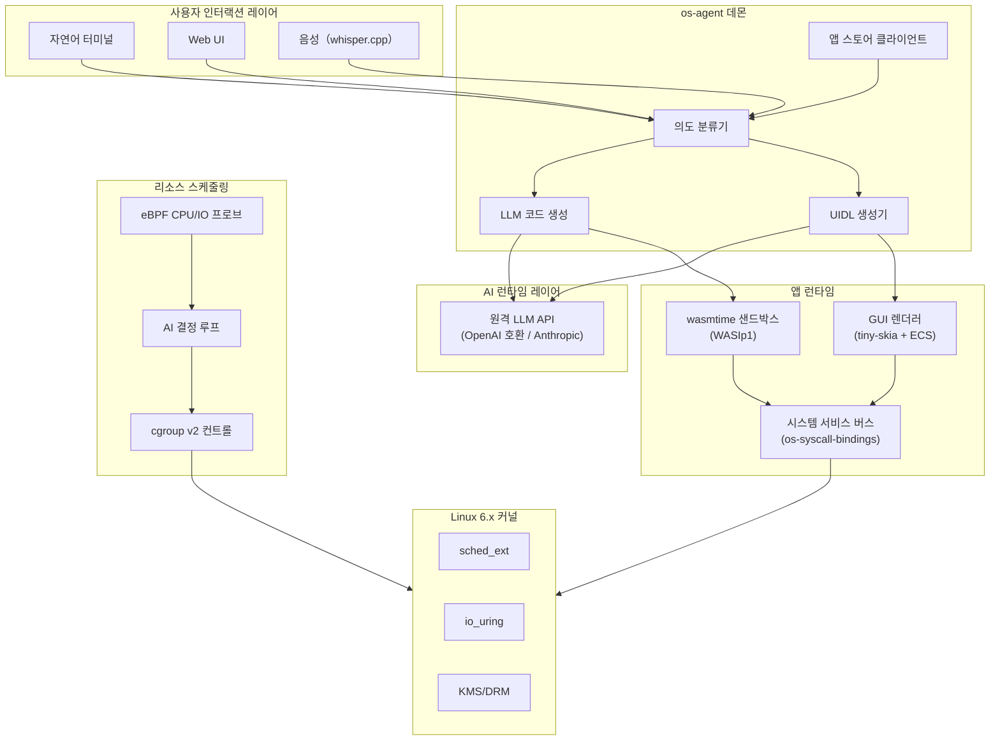
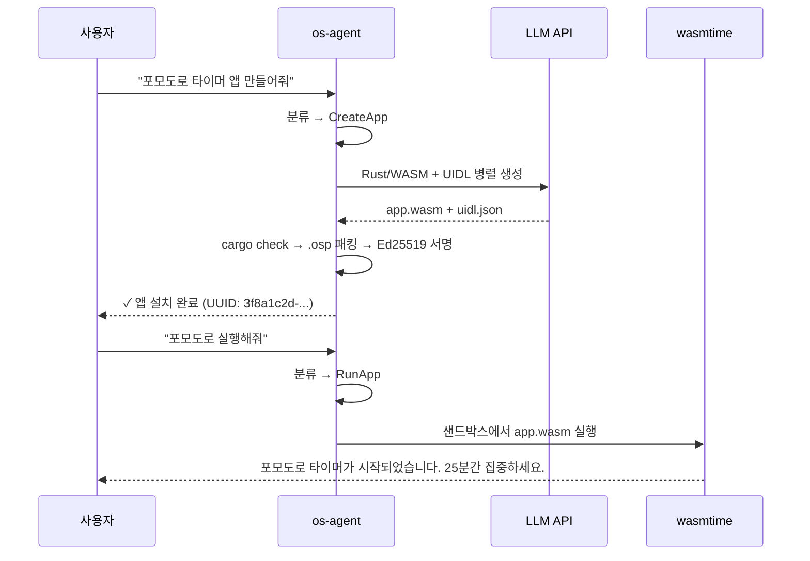

# openSystem

**AI를 전제로 하는 운영체제.**

[](https://github.com/soolaugust/openSystem/actions)
[](https://github.com/soolaugust/openSystem/releases)
[](https://github.com/soolaugust/openSystem/actions)
[](https://github.com/soolaugust/openSystem/actions)
[](LICENSE)

> ⚠️ **실험적 프로젝트.** 본 프로젝트는 초기 연구 단계에 있으며, 프로덕션 환경에서의 사용은 권장하지 않습니다.
> API, 설정 형식, 아키텍처는 예고 없이 변경될 수 있습니다. 기여와 대담한 아이디어를 환영합니다.

[English](README.md) | [简体中文](README.zh-CN.md) | [日本語](README.ja.md) | 한국어

---

오늘날 존재하는 모든 운영체제는 대형 언어 모델이 등장하기 전에 설계되었습니다.
Linux는 인간이 조작하도록 설계되었습니다. openSystem은 AI가 조작하도록 설계되었습니다——
그리고 인간이 *지시*합니다.

openSystem은 Linux 배포판이 아닙니다. 연구 프로토타입도 아닙니다.
이것은 명확한 베팅입니다: 5년 이내에 모든 의미 있는 OS 상호작용은 AI에 의해 매개될 것입니다.
우리는 그 전제에서 출발하는 OS를 구축하고 있습니다. 50년의 POSIX 레거시 위에 AI를 얹는 것이 아니라.

**당신이 다음을 믿는다면, 이 프로젝트는 당신을 불쾌하게 할 것입니다:**
- 결정론적 시스템은 항상 확률론적 시스템보다 안전하다
- 사용자는 OS가 무엇을 하는지 이해해야 한다
- POSIX 호환성은 제약이 아니라 기능이다

**당신이 다음을 믿는다면, 이 프로젝트는 당신을 위한 것입니다:**
- 1970년대 셸 비유는 이미 역할을 다했다
- AI 추론은 시스템 콜 경로에 들어갈 만큼 충분히 저렴해졌다
- 당신이 사용해 볼 최고의 OS는 아직 만들어지지 않았다

---

## 데모

> 한 마디로 30초 안에 실행 중인 앱을 만들 수 있습니다.

<p align="center">
  
</p>

**무슨 일이 일어났나:** 자연어 → LLM이 Rust/WASM 코드 생성 → 컴파일 → Ed25519 서명 `.osp` 패키지 → 설치 → wasmtime 샌드박스에서 실행. 패키지 매니저 불필요. 앱스토어 심사 불필요. 사전 바이너리 불필요.

---

## 현재 사용 가능한 기능 (v0.5.0)

| 기능 | 상태 | 구현 |
|------|------|------|
| 자연어 → 앱 생성 | ✅ 동작 중 | `os-agent` 의도 파이프라인 + LLM 코드 생성 |
| WASM 샌드박스 실행 | ✅ 동작 중 | wasmtime / WASIp1, `MemoryOutputPipe` 출력 캡처 |
| 앱 스토어 설치/검색 | ✅ 동작 중 | SQLite 레지스트리 + Ed25519 서명 `.osp` 패키지 |
| 패키지 서명 검증 | ✅ 동작 중 | `OspPackage::verify_signature` + E2E 테스트 |
| 소프트웨어 GUI 렌더링 | ✅ 동작 중 | tiny-skia 0.12 + fontdue 0.9 픽셀 래스터라이저 |
| UIDL → ECS 컴포넌트 트리 | ✅ 동작 중 | `build_ecs_tree()` 히트 테스트·레이아웃 엔진 포함 |
| UI 이벤트 → WASM 콜백 | ✅ 동작 중 | `EventBridge` 양방향 채널 |
| AI 생성 GUI 레이아웃 | ✅ 동작 중 | `UIDL_GEN_SYSTEM_PROMPT` few-shot 스키마 |
| AI 구동 리소스 스케줄링 | ✅ 동작 중 | eBPF 프로브 + cgroup v2 + LLM 결정 루프 |
| Timer 시스콜 (interval/clear) | ✅ 동작 중 | polling 모델, 논블로킹 detach |
| 데스크톱 알림 | ✅ 동작 중 | `notify_send` + fallback 구현 |
| Storage 앱 격리 | ✅ 동작 중 | 격리 검증 테스트 |
| GPU 가속 렌더링 | 🔜 v0.6.0 | Bevy + wgpu (ECS 트리 연결 대기 중) |
| WASM 실행 시간 제한 | 🔜 v0.6.0 | epoch interrupt CPU 예산 |

**지표:** 392개 테스트 · clippy 경고 0 · 커버리지 80%

---

## 아키텍처



### 앱 라이프사이클



---

## 시작하기

### 요구 사항
- Rust 1.75+
- `wasm32-wasip1` Rust 타겟: `rustup target add wasm32-wasip1`
- Python 3.10+（rom-builder 스크립트용）
- QEMU（테스트용）
- 원격 LLM API 엔드포인트（OpenAI 호환 또는 Anthropic 네이티브）

### 빌드

```bash
git clone https://github.com/soolaugust/openSystem
cd openSystem
cargo build --workspace
cargo test --workspace   # 392개 테스트, 전체 통과
```

### QEMU에서 실행

```bash
# 시스템 이미지 빌드
python3 rom-builder/build.py --manifest hardware_manifest_qemu.json

# 헤드리스 모드 (시리얼 콘솔)
qemu-system-x86_64 \
  -hda system.img -m 8G -smp 4 -enable-kvm \
  -device virtio-net-pci,netdev=net0 \
  -netdev user,id=net0,hostfwd=tcp::8080-:8080 \
  -nographic

# GUI 세션
qemu-system-x86_64 \
  -hda system.img -m 8G -smp 4 -enable-kvm \
  -device virtio-gpu -device virtio-keyboard-pci -device virtio-mouse-pci \
  -device virtio-net-pci,netdev=net0 \
  -netdev user,id=net0,hostfwd=tcp::8080-:8080
```

### AI 모델 설정

최초 부팅 시 설정 마법사가 대화형으로 모델 설정을 안내합니다.
재설정: `opensystem-setup`

설정 파일 `/etc/os-agent/model.conf`:

```toml
[api]
base_url = "https://api.deepseek.com/v1"   # OpenAI 호환 엔드포인트라면 모두 가능
api_key  = "<your-api-key>"
model    = "deepseek-chat"
# api_format = "anthropic"                 # Anthropic 네이티브 형식 사용 시 주석 해제

[network]
timeout_ms  = 10000
retry_count = 3

[fallback]                                 # 선택 사항: 폴백 엔드포인트
base_url = "https://api.anthropic.com/v1"
api_key  = "<your-api-key>"
model    = "claude-sonnet-4-6"
```

| 형식 | `api_format` 값 | 인증 헤더 | 지원 제공업체 예시 |
|------|----------------|----------|-----------------|
| OpenAI 호환 (기본값) | `"openai"` 또는 생략 | `Authorization: Bearer` | DeepSeek, Qwen, vLLM, OpenAI |
| Anthropic 네이티브 | `"anthropic"` | `x-api-key` | Claude (api.anthropic.com) |

> URL에 `"anthropic"`이 포함되면 Anthropic 형식으로 자동 감지됩니다.

---

## 컴포넌트 목록

| 크레이트 | 설명 | 테스트 수 |
|---------|------|---------|
| `os-agent` | 코어 데몬: NL 터미널, 의도 분류, 앱 생성, WASM 실행기 | 59 |
| `gui-renderer` | UIDL 레이아웃 엔진, 소프트웨어 래스터라이저, ECS 트리, 이벤트 브리지 | 64 |
| `app-store` | Ed25519 서명 `.osp` 레지스트리, HTTP API, `osctl` CLI | 48 |
| `resource-scheduler` | AI 구동 cgroup v2 관리, eBPF CPU/IO 프로브 | — |
| `rom-builder` | 하드웨어 매니페스트 리졸버, QEMU 보드 지원, 디스크 이미지 패키징 | — |
| `os-syscall-bindings` | WASI syscall API, 메모리 안전 IPC, 타이머 관리 | 58 |

---

## Linux와의 관계

> openSystem은 v1에서 Linux를 하드웨어 추상화 레이어로 사용하면서, 자체 커널을 병행 개발합니다.
> 하드웨어 지원을 위해 Linux를 참조하며, 30년간의 드라이버 작업에 감사드립니다.
> 하지만 우리의 프로세스 모델은 POSIX가 아니며, 우리의 셸은 셸이 아닙니다.
> Linux 호환성이 필요하다면: 이 프로젝트를 포크하여 호환 레이어를 구축하세요——링크는 걸겠지만, 절대 머지하지 않겠습니다.

---

## 논쟁적 입장

**시스템 콜 경로의 AI에 대해:**
> "AI 추론이 너무 느리지 않나요?" — 지금은 그렇습니다. 우리는 추론 지연이 1000ms가 아닌 10ms인 세계를 위해 최적화하고 있습니다.

**네트워크 의존성에 대해:**
> 오프라인 모드는 목표가 아닙니다. 이것은 iPhone이 iCloud에 대해 내린 것과 같은 결정입니다.

**POSIX에 대해:**
> openSystem에서 소프트웨어는 온디맨드로 생성됩니다. POSIX 호환성은 스트리밍 서비스에 VHS 지원을 요구하는 것과 같습니다.

---

## 기여하기

openSystem은 활발히 개발 중입니다. 다음 분야에서 기여를 환영합니다:

- **GPU 렌더링** — ECS 트리를 Bevy + wgpu에 연결（[`gui-renderer/src/bevy_renderer.rs`](gui-renderer/src/bevy_renderer.rs)）
- **WASM host functions** — `net_http_get`, storage 격리, syscall 바인딩 구현（[`os-agent/src/wasm_runtime.rs`](os-agent/src/wasm_runtime.rs)）
- **테스트 커버리지** — 현재 80%, 목표 90%+（[이슈 보기](https://github.com/soolaugust/openSystem/issues)）
- **음성 인터페이스** — whisper.cpp 통합 스텁 완료, 실제 구현 필요
- **대담한 아이디어** — AI를 위한 OS가 흥미롭다고 생각한다면 이슈를 열어주세요

```bash
cargo test --workspace                       # 전체 테스트 실행
cargo clippy --workspace -- -D warnings      # 제로 경고 정책
```

---

## 라이선스

MIT
