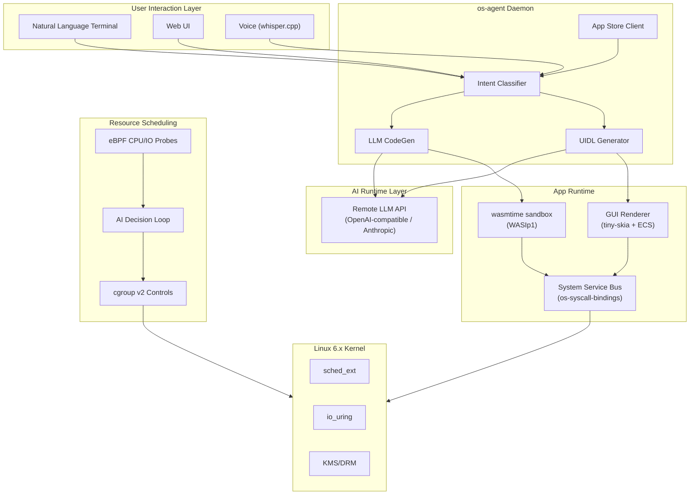
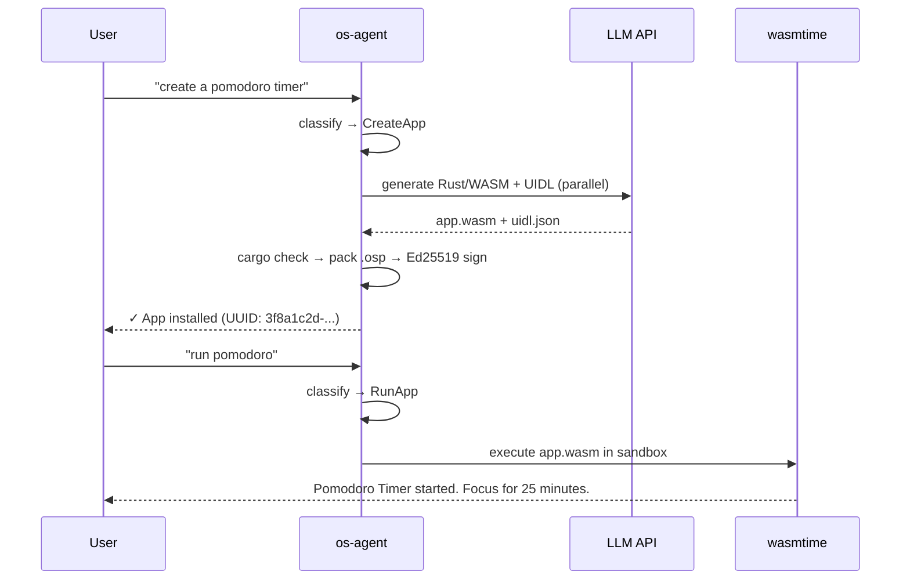

# openSystem

**The OS that assumes you have AI.**

[](https://github.com/soolaugust/openSystem/actions)
[](https://github.com/soolaugust/openSystem/releases)
[](https://github.com/soolaugust/openSystem/actions)
[](https://github.com/soolaugust/openSystem/actions)
[](LICENSE)

> ⚠️ **Experimental.** Early-stage research. APIs and architecture will change. Contributions and wild ideas welcome.

English | [简体中文](README.zh-CN.md) | [日本語](README.ja.md) | [한국어](README.ko.md)

---

Every operating system alive today was designed before large language models existed.
Linux was designed for humans to operate. openSystem is designed for AI to operate —
and for humans to *direct*.

openSystem is not a Linux distribution. It is not a research prototype.
It is an opinionated bet: that within five years, every meaningful OS interaction
will be mediated by AI. We are building the OS that starts from that assumption,
not one that bolts AI on top of 50 years of POSIX legacy.

**This project will offend you if you believe:**
- Deterministic systems are always safer than probabilistic ones
- Users should understand what their OS is doing
- POSIX compatibility is a feature, not a constraint

**This project is for you if you believe:**
- The 1970s shell metaphor has overstayed its welcome
- AI inference is cheap enough to be in the syscall path
- The best OS you'll ever use hasn't been built yet

---

## See It in Action

> Say a sentence. Get a running app — in under 30 seconds.

<p align="center">
  
</p>

**What just happened:** Natural language → LLM generates Rust/WASM code → compiled → Ed25519-signed `.osp` package → installed → executed in wasmtime sandbox. No package manager. No app store curation. No pre-existing binary.

---

## What Works Today (v0.5.0)

| Capability | Status | Implementation |
|-----------|--------|----------------|
| Natural language → app creation | ✅ Working | `os-agent` intent pipeline + LLM codegen |
| WASM sandbox execution | ✅ Working | wasmtime / WASIp1 with `MemoryOutputPipe` |
| App Store install/search | ✅ Working | SQLite registry + Ed25519 signed `.osp` packages |
| Package signature verification | ✅ Working | `OspPackage::verify_signature` + end-to-end tests |
| Software GUI rendering | ✅ Working | tiny-skia 0.12 + fontdue 0.9 pixel rasterizer |
| UIDL → ECS component tree | ✅ Working | `build_ecs_tree()` with hit-test and layout engine |
| UI event → WASM callbacks | ✅ Working | `EventBridge` bidirectional channel |
| AI-generated GUI layouts | ✅ Working | `UIDL_GEN_SYSTEM_PROMPT` few-shot schema |
| AI-driven resource scheduling | ✅ Working | eBPF probes + cgroup v2 + LLM decision loop |
| Timer syscalls (interval/clear) | ✅ Working | polling model, non-blocking detach |
| Desktop notifications | ✅ Working | `notify_send` + fallback impl |
| Storage per-app isolation | ✅ Working | verified isolation tests |
| GPU-accelerated rendering | 🔜 v0.6.0 | Bevy + wgpu (ECS tree ready to connect) |
| WASM epoch interruption | 🔜 v0.6.0 | CPU time budget enforcement |

**Metrics:** 392 tests · 0 clippy warnings · 80% coverage

---

## Architecture



### App Lifecycle



---

## Quick Start

### Requirements
- Rust 1.75+
- `wasm32-wasip1` target: `rustup target add wasm32-wasip1`
- Python 3.10+ (for rom-builder scripts)
- QEMU (for testing)
- A remote LLM API endpoint (OpenAI-compatible or Anthropic native)

### Build

```bash
git clone https://github.com/soolaugust/openSystem
cd openSystem
cargo build --workspace
cargo test --workspace   # 392 tests, all passing
```

### Run in QEMU

```bash
# Build the system image
python3 rom-builder/build.py --manifest hardware_manifest_qemu.json

# Headless (serial console)
qemu-system-x86_64 \
  -hda system.img -m 8G -smp 4 -enable-kvm \
  -device virtio-net-pci,netdev=net0 \
  -netdev user,id=net0,hostfwd=tcp::8080-:8080 \
  -nographic

# GUI session
qemu-system-x86_64 \
  -hda system.img -m 8G -smp 4 -enable-kvm \
  -device virtio-gpu -device virtio-keyboard-pci -device virtio-mouse-pci \
  -device virtio-net-pci,netdev=net0 \
  -netdev user,id=net0,hostfwd=tcp::8080-:8080
```

### Configure AI Model

On first boot, a setup wizard guides you through model configuration.
To reconfigure: `opensystem-setup`

Config at `/etc/os-agent/model.conf`:

```toml
[api]
base_url = "https://api.deepseek.com/v1"   # Any OpenAI-compatible endpoint
api_key  = "<your-api-key>"
model    = "deepseek-chat"
# api_format = "anthropic"                 # Uncomment for Anthropic native format

[network]
timeout_ms  = 10000
retry_count = 3

[fallback]                                 # Optional: fallback endpoint
base_url = "https://api.anthropic.com/v1"
api_key  = "<your-api-key>"
model    = "claude-sonnet-4-6"
```

| Format | `api_format` value | Auth header | Example providers |
|--------|-------------------|-------------|-------------------|
| OpenAI-compatible (default) | `"openai"` or omit | `Authorization: Bearer` | DeepSeek, Qwen, vLLM, OpenAI |
| Anthropic native | `"anthropic"` | `x-api-key` | Claude (api.anthropic.com) |

> Endpoints containing `"anthropic"` are auto-detected — no need to set `api_format` explicitly.

---

## Component Overview

| Crate | Description | Tests |
|-------|-------------|-------|
| `os-agent` | Core daemon: NL terminal, intent classification, app generation, WASM runner | 59 |
| `gui-renderer` | UIDL layout engine, software rasterizer, ECS tree, event bridge | 64 |
| `app-store` | Ed25519-signed `.osp` registry, HTTP API, `osctl` CLI | 48 |
| `resource-scheduler` | AI-driven cgroup v2 management, eBPF CPU/IO probes | — |
| `rom-builder` | Hardware manifest resolver, QEMU board support, disk image packaging | — |
| `os-syscall-bindings` | WASI syscall API, memory-safe IPC, timer management | 58 |

---

## Relationship with Linux

> openSystem uses Linux as a hardware abstraction layer in v1, while developing our own kernel in parallel.
> We use Linux as a reference for hardware support, and are grateful for 30 years of driver work.
> But our process model is not POSIX, and our shell is not a shell.
> If you want Linux compatibility: fork this project and make a compatibility layer — we will link to it and never merge it.

---

## Controversial Positions

**On AI in the syscall path:**
> "Isn't AI inference too slow to be in the OS path?" — Yes, for now. We are optimizing for the world where inference is 10ms, not 1000ms.

**On network dependency:**
> Offline mode is not a goal. This is the same decision your iPhone made with iCloud.

**On POSIX:**
> In openSystem, software is generated on-demand. POSIX compatibility here is like insisting a streaming service support VHS.

---

## Contributing

openSystem is in active development. The areas most open for contribution:

- **GPU rendering** — connect the ECS tree to Bevy + wgpu ([`gui-renderer/src/bevy_renderer.rs`](gui-renderer/src/bevy_renderer.rs))
- **WASM host functions** — implement `net_http_get`, storage isolation, syscall bindings ([`os-agent/src/wasm_runtime.rs`](os-agent/src/wasm_runtime.rs))
- **Test coverage** — currently at 80%, targeting 90%+ ([see open issues](https://github.com/soolaugust/openSystem/issues))
- **Voice interface** — whisper.cpp integration is stubbed, needs real impl
- **Wild ideas** — if you think an OS built for AI is interesting, open an issue

```bash
cargo test --workspace                       # Run all tests
cargo clippy --workspace -- -D warnings      # Zero-warning policy
```

---

## License

MIT
