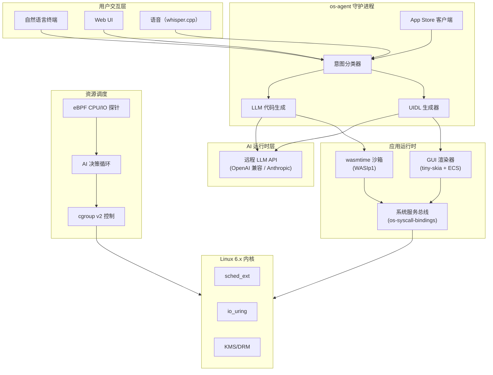
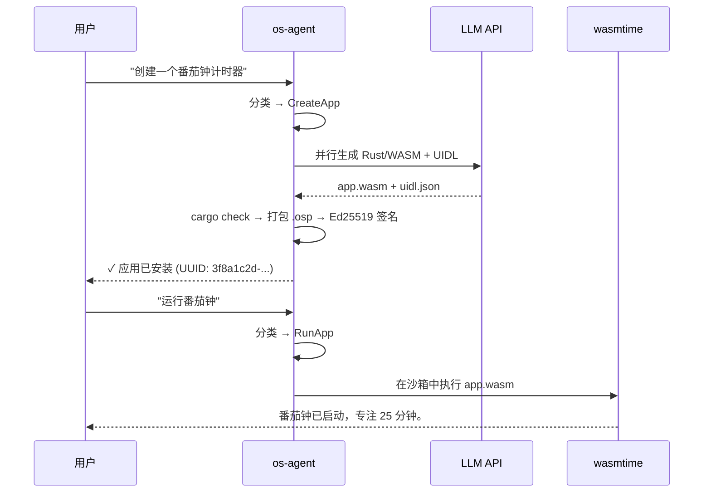

# openSystem

**为 AI 而生的操作系统。**

[](https://github.com/soolaugust/openSystem/actions)
[](https://github.com/soolaugust/openSystem/releases)
[](https://github.com/soolaugust/openSystem/actions)
[](https://github.com/soolaugust/openSystem/actions)
[](LICENSE)

> ⚠️ **实验性项目。** 本项目处于早期研究阶段，不适合生产使用。
> API、配置格式和架构可能随时变更，欢迎贡献代码和各种大胆想法。

[English](README.md) | 简体中文 | [日本語](README.ja.md) | [한국어](README.ko.md)

---

今天所有运行中的操作系统，都诞生于大语言模型存在之前。
Linux 是为人类操作而设计的。openSystem 是为 AI 操作而设计的——
而人类负责*指挥*。

openSystem 不是 Linux 发行版，也不是研究原型。
它是一个明确的押注：在未来五年内，每一次有意义的操作系统交互都将由 AI 介入。
我们正在构建从这个假设出发的操作系统，而不是把 AI 叠加在 50 年 POSIX 遗产之上。

**如果你相信以下观点，本项目会冒犯你：**
- 确定性系统永远比概率性系统更安全
- 用户应该理解操作系统在做什么
- POSIX 兼容性是特性，而不是约束

**如果你相信以下观点，本项目正是为你而生：**
- 1970 年代的 Shell 隐喻早该退出历史舞台
- AI 推理已经足够便宜，可以进入系统调用路径
- 你用过的最好的操作系统还没有被构建出来

---

## 效果演示

> 说一句话，得到一个运行中的应用——30 秒内。

<p align="center">
  
</p>

**刚才发生了什么：** 自然语言 → LLM 生成 Rust/WASM 代码 → 编译 → Ed25519 签名 `.osp` 包 → 安装 → 在 wasmtime 沙箱中执行。无包管理器，无应用商店审核，无预置二进制文件。

---

## 当前可用功能（v0.5.0）

| 功能 | 状态 | 实现 |
|------|------|------|
| 自然语言 → 应用创建 | ✅ 可用 | `os-agent` 意图流水线 + LLM 代码生成 |
| WASM 沙箱执行 | ✅ 可用 | wasmtime / WASIp1，`MemoryOutputPipe` 捕获输出 |
| App Store 安装/搜索 | ✅ 可用 | SQLite 注册表 + Ed25519 签名 `.osp` 包 |
| 包签名验证 | ✅ 可用 | `OspPackage::verify_signature` + 端到端测试 |
| 软件 GUI 渲染 | ✅ 可用 | tiny-skia 0.12 + fontdue 0.9 像素光栅化 |
| UIDL → ECS 组件树 | ✅ 可用 | `build_ecs_tree()` 含命中测试和布局引擎 |
| UI 事件 → WASM 回调 | ✅ 可用 | `EventBridge` 双向通道 |
| AI 生成 GUI 布局 | ✅ 可用 | `UIDL_GEN_SYSTEM_PROMPT` few-shot 约束 |
| AI 驱动资源调度 | ✅ 可用 | eBPF 探针 + cgroup v2 + LLM 决策循环 |
| Timer 系统调用（interval/clear） | ✅ 可用 | polling 模型，非阻塞 detach |
| 桌面通知 | ✅ 可用 | `notify_send` + fallback 实现 |
| Storage 应用级隔离 | ✅ 可用 | 隔离验证测试 |
| GPU 加速渲染 | 🔜 v0.6.0 | Bevy + wgpu（ECS 树已就绪待接入）|
| WASM 执行时间限制 | 🔜 v0.6.0 | epoch interrupt CPU 预算 |

**指标：** 392 个测试 · 0 个 clippy 警告 · 80% 覆盖率

---

## 架构



### 应用生命周期



---

## 快速开始

### 环境要求
- Rust 1.75+
- `wasm32-wasip1` 编译目标：`rustup target add wasm32-wasip1`
- Python 3.10+（用于 rom-builder 脚本）
- QEMU（用于测试）
- 远程 LLM API 端点（OpenAI 兼容或 Anthropic 原生）

### 构建

```bash
git clone https://github.com/soolaugust/openSystem
cd openSystem
cargo build --workspace
cargo test --workspace   # 392 个测试，全部通过
```

### 在 QEMU 中运行

```bash
# 构建系统镜像
python3 rom-builder/build.py --manifest hardware_manifest_qemu.json

# 无头模式（串口控制台）
qemu-system-x86_64 \
  -hda system.img -m 8G -smp 4 -enable-kvm \
  -device virtio-net-pci,netdev=net0 \
  -netdev user,id=net0,hostfwd=tcp::8080-:8080 \
  -nographic

# GUI 会话
qemu-system-x86_64 \
  -hda system.img -m 8G -smp 4 -enable-kvm \
  -device virtio-gpu -device virtio-keyboard-pci -device virtio-mouse-pci \
  -device virtio-net-pci,netdev=net0 \
  -netdev user,id=net0,hostfwd=tcp::8080-:8080
```

### 配置 AI 模型

首次启动时，向导会交互式引导你完成模型配置。之后可随时重新配置：`opensystem-setup`

配置文件位于 `/etc/os-agent/model.conf`：

```toml
[api]
base_url = "https://api.deepseek.com/v1"   # 任何 OpenAI 兼容端点
api_key  = "<your-api-key>"
model    = "deepseek-chat"
# api_format = "anthropic"                 # Anthropic 原生格式时取消注释

[network]
timeout_ms  = 10000
retry_count = 3

[fallback]                                 # 可选：备用端点
base_url = "https://api.anthropic.com/v1"
api_key  = "<your-api-key>"
model    = "claude-sonnet-4-6"
```

| 格式 | `api_format` 值 | 认证 header | 示例服务商 |
|------|----------------|-------------|-----------|
| OpenAI 兼容（默认）| `"openai"` 或省略 | `Authorization: Bearer` | DeepSeek、Qwen、vLLM、OpenAI |
| Anthropic 原生 | `"anthropic"` | `x-api-key` | Claude (api.anthropic.com) |

> URL 中包含 `"anthropic"` 时会自动识别为 Anthropic 格式，无需手动设置 `api_format`。

---

## 各组件一览

| Crate | 功能说明 | 测试数 |
|-------|---------|--------|
| `os-agent` | 核心守护进程：NL 终端、意图分类、应用生成、WASM 运行 | 59 |
| `gui-renderer` | UIDL 布局引擎、软件光栅化、ECS 树、事件桥 | 64 |
| `app-store` | Ed25519 签名 `.osp` 注册表、HTTP API、`osctl` CLI | 48 |
| `resource-scheduler` | AI 驱动 cgroup v2 管理、eBPF CPU/IO 探针 | — |
| `rom-builder` | 硬件清单解析器、QEMU 板级支持、磁盘镜像打包 | — |
| `os-syscall-bindings` | WASI 系统调用 API、内存安全 IPC、定时器管理 | 58 |

---

## 与 Linux 的关系

> openSystem 在 v1 中将 Linux 作为硬件抽象层，同时并行开发自己的内核。
> 我们借鉴 Linux 的硬件支持，感谢 30 年的驱动程序积累。
> 但我们的进程模型不是 POSIX，我们的 Shell 不是 Shell。
> 如果你需要 Linux 兼容性：Fork 本项目并构建兼容层——我们会链接它，但永远不会合并。

---

## 争议性立场

**关于 AI 在系统调用路径上：**
> "AI 推理不是太慢了吗？" — 现在是的。我们正在为推理延迟 10ms 的世界优化，而不是 1000ms。

**关于网络强依赖：**
> 离线模式不是目标。这和你的 iPhone 选择 iCloud 的决策一样。

**关于 POSIX：**
> 在 openSystem 中，软件是按需生成的。POSIX 兼容性就像坚持让流媒体平台支持 VHS 一样。

---

## 参与贡献

openSystem 正在积极开发中，以下方向最欢迎贡献：

- **GPU 渲染** — 将 ECS 树接入 Bevy + wgpu（[`gui-renderer/src/bevy_renderer.rs`](gui-renderer/src/bevy_renderer.rs)）
- **WASM host functions** — 实现 `net_http_get`、storage 隔离、syscall bindings（[`os-agent/src/wasm_runtime.rs`](os-agent/src/wasm_runtime.rs)）
- **测试覆盖率** — 当前 80%，目标 90%+（[查看 issues](https://github.com/soolaugust/openSystem/issues)）
- **语音接口** — whisper.cpp 集成已有桩代码，需要真实实现
- **大胆想法** — 如果你认为为 AI 构建操作系统是个有趣的方向，欢迎开 issue

```bash
cargo test --workspace                       # 运行全部测试
cargo clippy --workspace -- -D warnings      # 零警告策略
```

---

## 许可证

MIT
